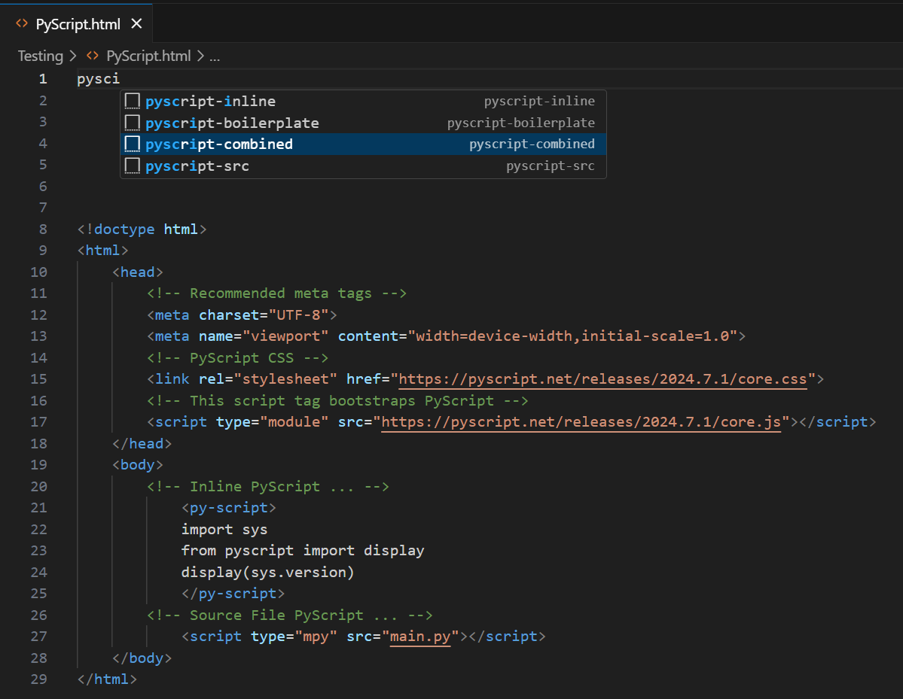

##  PyScript Boilerplate Generator

The extension provides the very basic PyScript boiler plate.

## Usage & Options
The extension includes 4 ways to generate the boiler plates for PyScript as per the needs. 

1. **PyScript-BoilerPlate** - Generates the basic PyScript code snippet.

2. **PyScript-Combined** - Generated full boiler plate including inline and source snippets.

3. **PyScript-Inline** - Only generates the PyScript inline code snippet.

4. **PyScript-Src** - Only generates the PyScript source file snippet. 

## Installation

In order to install the extension the following is required to be done having assumed that you have VSCode installed on your machine or else do the following. 

### Using Command Palette

1. Install VSCode
2. Launch VSCode
3. Open the `Command Palette` by holding `CTRL+SHIFT+P` or `CTRL+P`. 
4. Type `Install Extension` then select `Extensions: Install Extensions`
5. Type `PyScript-BoilerPlate`
6. Select the extension to install.
7. Choose the extension. 
8. Start using it.

### Using Extensions

1. Open Extension Menu from the left-side.
2. Search for `PyScript Boilerplate Generator`.
3. Install the extension.
4. Start using it.  

## Contact
In case of issues/errors/suggestions, please check out the official repository. 

https://github.com/deFr0ggy/PyScript-Boiler-Plate

## References

- [Code Snippets](https://docs.pyscript.net/2024.7.1/user-guide/first-steps/)